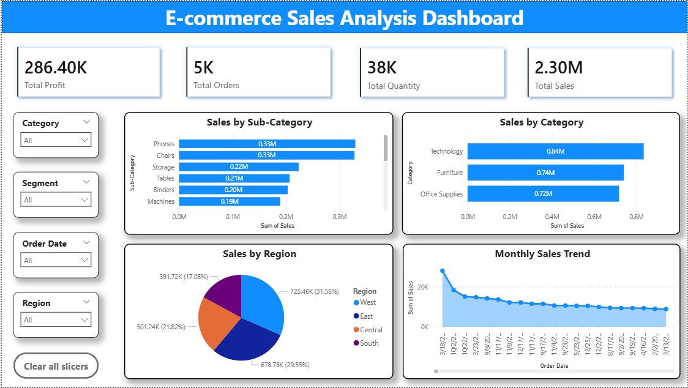

# E-Commerce Sales Analysis Dashboard (Power BI)

This project presents an interactive sales analysis dashboard built using Microsoft Power BI.  
The dashboard analyzes key business metrics such as sales, profit, quantity, product categories, and regional performance using the Superstore dataset.

---

## 📁 Project Overview

The goal of this project is to demonstrate how business data can be transformed into meaningful insights using data visualization tools.

The dashboard helps answer questions such as:

- Which product categories generate the highest sales?
- Which regions are most profitable?
- How do sales and profits vary across different segments?

---

## 📊 Dashboard Pages

### 1️⃣ Sales Overview Dashboard
Provides a high-level view of business performance including:
- Total Sales
- Total Profit
- Total Quantity
- Sales distribution across regions and categories
- Interactive slicers for filtering data

### 2️⃣ Product Analysis
Analyzes product performance to identify top-performing categories and products:
- Sales by Category
- Profit by Category
- Top products based on sales or profit
- Category comparison

### 3️⃣ Customer and Product Insights
Provides deeper insights into customer behavior and product performance:
- Sales by Customer Segment
- Product demand analysis
- Profit contribution by different segments

---

## Dashboard Preview

(Add screenshot images here)

Example:



---

## 📂 Project Files

```
PowerBI-Ecommerce-Analysis
│
├── dataset
│   └── superstore.csv
│
├── dashboard
│   └── ecommerce_dashboard.pbix
│
├── images
│   └── dashboard_preview.png
│
└── README.md
```

---

## 📈 Key Insights

- Identified top performing product categories.
- Analyzed regional sales performance.
- Compared sales and profit trends.

---
